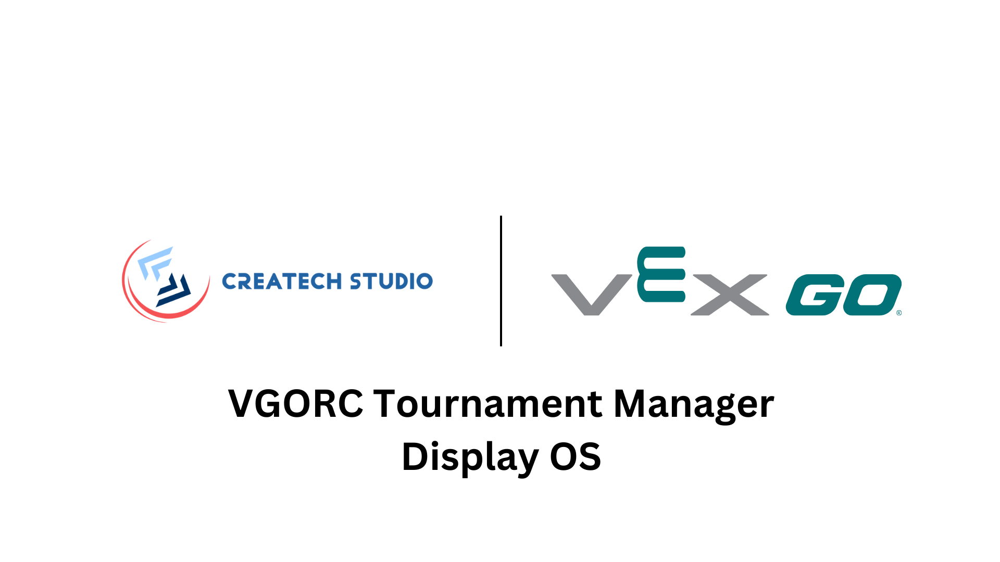

<p align="center">
<a href="./media/displayos.png">

</a>
</p>

> Based on [FullPageOS by guysoft](https://github.com/guysoft/FullPageOS/issues/605)

## Usage

1. Unzip the image and install it to an SD card like any other Raspberry Pi image

2. Configure your WiFi by editing wifi.nmconnection on the first partition of the flashed card when using it like a flash drive

3. Boot the Pi from the SD card

4. Log into your Pi via SSH (it is located at fullpageos.local if your computer supports bonjour or the IP address assigned by your router), default username is `pi`, default password is `raspberry` and change the password using the `passwd` command. Consider also changing the vnc password as well by x11vnc -storepasswd.

### CLI

After connect via SSH, use `cd scripts` to enter the scripts folder.

#### get_url

Get the URL from the `fullpageos.txt` file.

#### refresh

Refresh Chromium by using `killall`.

#### safe_refresh

Refresh Chromium by emulating `F5` key.

### URL

Set in the VGORC Tournament Manager - Admin - Display Settings - URL.

All the variable name should be encoded in the URL.

> Division A → Division%20A.

#### Ranking

1. Qualification Ranking

```
division={DIVISION_NAME}#qrank
```

2. Elimination Ranking

```
division={DIVISION_NAME}#erank
```

3. Skills Ranking

```
#srank
```

#### Scheudle

```
division={DIVISION_NAME}#schedule
```

#### Match Timer

```
displayMode=1&fieldName={FIELD_NAME}#score
```
